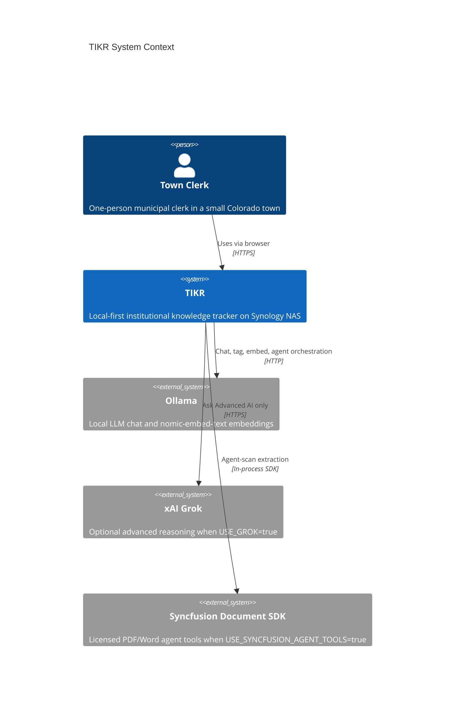
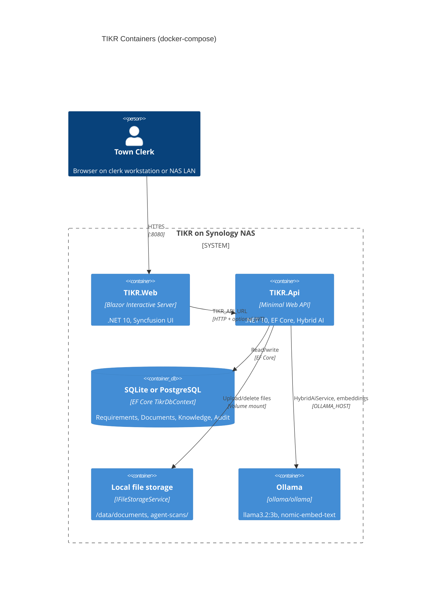
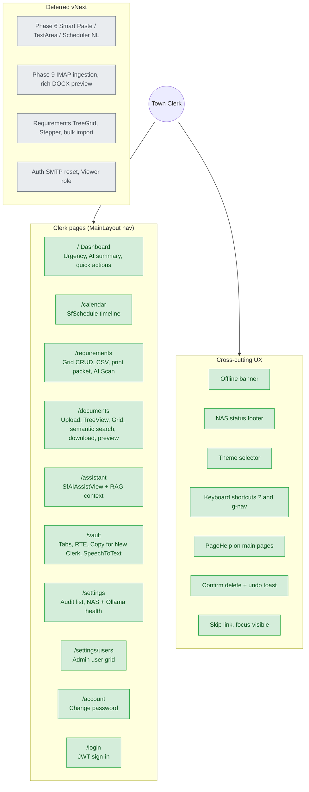
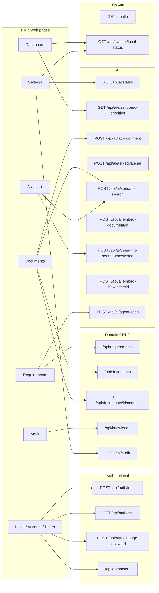
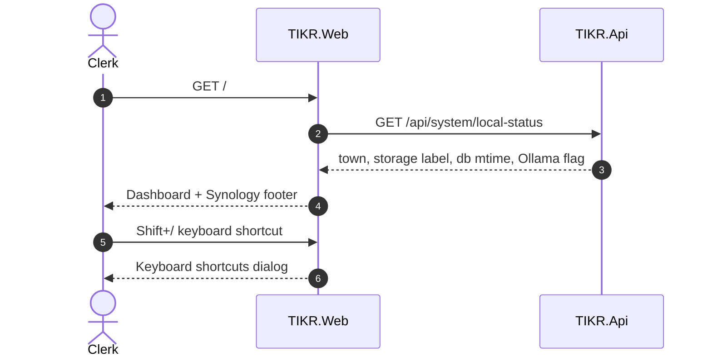
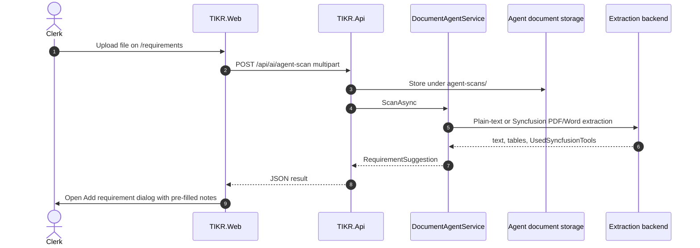
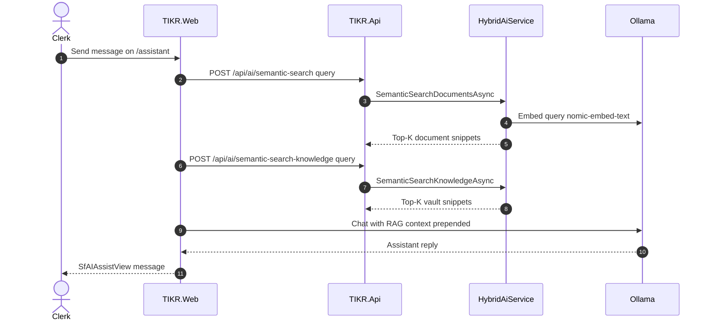
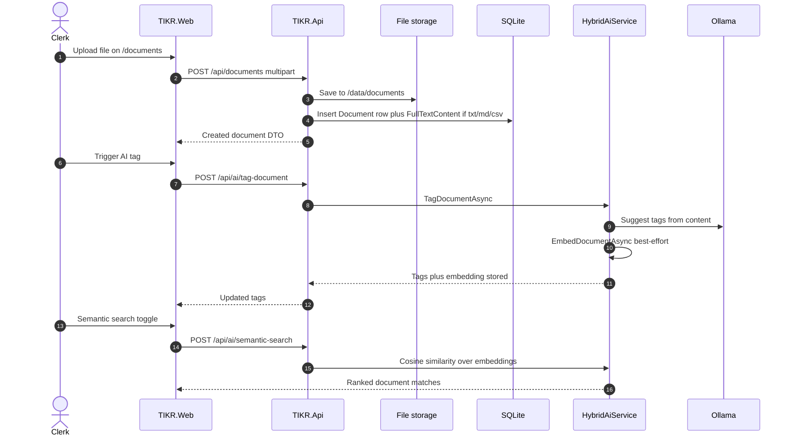
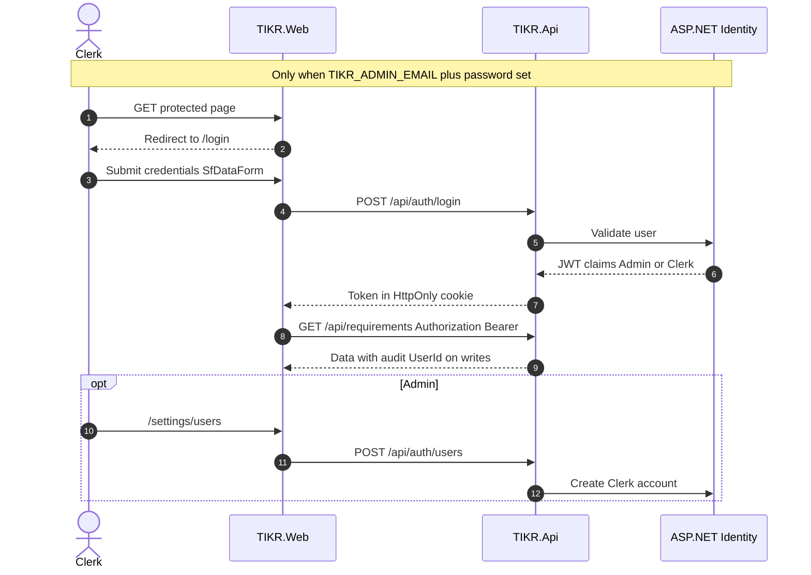
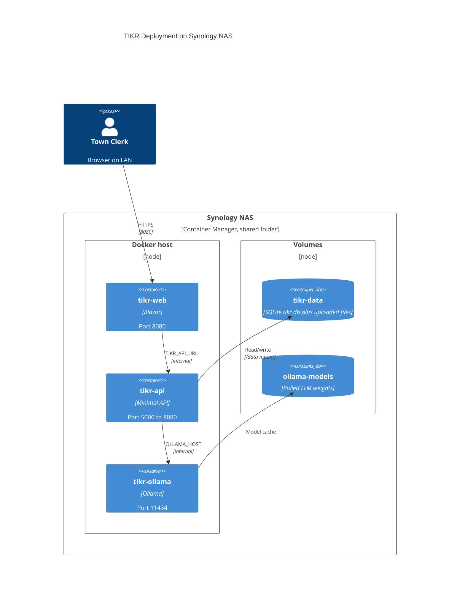

# TIKR Architecture

## Overview

TIKR (Town Institutional Knowledge Tracker) is a **local-first** web application for one-person town clerks in small Colorado municipalities. All data stays on the Synology NAS by default.

**Tagline:** *The Town Clerk's Second Brain*

**E2E diagrams:** Living Mermaid sources in [docs/diagrams/](diagrams/README.md) (feature map, API surface, clerk flows, deployment). Rendered copies are embedded below.

## Layer Diagram (quick reference)

```
┌─────────────────────────────────────────────────────────┐
│  TIKR.Web (Blazor Interactive Server + Syncfusion)      │
│  Dashboard · Calendar · Documents · Knowledge · Settings│
└──────────────────────────┬──────────────────────────────┘
                           │ HTTP (TIKR_API_URL)
┌──────────────────────────▼──────────────────────────────┐
│  TIKR.Api (Minimal API, .NET 10)                        │
│  Requirements · Documents · Knowledge · Audit · AI      │
└──────────────────────────┬──────────────────────────────┘
                           │
        ┌──────────────────┼──────────────────┐
        ▼                  ▼                  ▼
┌───────────────┐  ┌───────────────┐  ┌───────────────┐
│ SQLite / PG   │  │ Local Files   │  │ Ollama + Grok │
│ (EF Core)     │  │ /data/docs    │  │ (Hybrid AI)   │
└───────────────┘  └───────────────┘  └───────────────┘
```

## Architecture diagrams (E2E)

Sources: `docs/diagrams/*.mmd`. Update diagram and this section together when routes or features change.

### System context



### Containers (Docker Compose)



### Clerk feature map

Status: **green** = shipped · **gray** = deferred vNext.



Legacy `/knowledge` redirects to `/vault`.

### API surface (UI → endpoints)



### E2E flows (sequence)

**Clerk smoke** — `tests/e2e/clerk-smoke.spec.ts`



**Requirements AI Scan** — `tests/e2e/requirements-agent-scan.spec.ts`



**Assistant RAG**



**Document lifecycle**



**Optional auth**



### Deployment (Synology NAS)



## Projects

| Project | Purpose |
|---------|---------|
| `TIKR.Shared` | Domain entities, DTOs, enums, service interfaces |
| `TIKR.Infrastructure` | EF Core DbContext, file storage, AI services |
| `TIKR.Api` | HTTP endpoints, DI wiring, database migration on startup |
| `TIKR.Web` | Blazor UI with Syncfusion components |

## Hybrid AI Strategy

1. **Routine tasks** (auto-tagging, dashboard priorities, summaries) → **Ollama** via `Microsoft.Extensions.AI` + **OllamaSharp**
2. **Advanced reasoning** (explicit user action only) → **xAI Grok** when `USE_GROK=true`

```
User action → HybridAiService
                 ├── Local: IChatClient (OllamaApiClient)
                 └── Advanced: GrokService (gated)
```

### Models (default)

- Chat: `llama3.2:3b` or `phi3:mini`
- Embeddings: `nomic-embed-text` (documents, vault entries, semantic search, Assistant RAG)

## Database

- **Default:** SQLite at `/data/tikr.db` (Docker volume)
- **Switch to PostgreSQL:** Set `DATABASE_PROVIDER=Postgres` and Npgsql connection string

## Audit Trail

All create/update/delete operations on Requirements, Documents, and Knowledge entries are logged to `AuditLog` for CORA/public records compliance. When multi-user auth is enabled, `UserId` is set to the clerk's email from the JWT.

## Authentication (optional multi-user)

Auth is **off by default** (single-clerk open access). Set bootstrap credentials in `docker/.env` to enable:

| Variable | Purpose |
|----------|---------|
| `TIKR_ADMIN_EMAIL` | First admin account (with password below, auto-enables auth) |
| `TIKR_ADMIN_PASSWORD` | Initial admin password (change after first login) |
| `TIKR_JWT_SIGNING_KEY` | HMAC secret for API JWTs (required when auth enabled) |
| `TIKR_AUTH_ENABLED` | Optional explicit override (`true` / `false`) |

**Flow:** Blazor Web login → `POST /api/auth/login` → JWT stored in HttpOnly cookie → `TikrApiClient` sends `Authorization: Bearer` to API. Roles: `Admin` (user management), `Clerk` (full clerk workflows).

**UI:** `/login`, `/account` (change password), `/settings/users` (Admin only, Syncfusion Grid + DataForm).

## NAS setup (Synology)

1. Map `tikr-data` Docker volume to a shared folder (e.g. `/volume1/tikr/data`)
2. Import `docker/docker-compose.yml` in Container Manager
3. Set `SYNCFUSION_LICENSE_KEY` for the web container
4. Optional multi-user: set `TIKR_ADMIN_EMAIL`, `TIKR_ADMIN_PASSWORD`, and `TIKR_JWT_SIGNING_KEY` on **both** `tikr-api` and `tikr-web` via `docker/.env`
5. Pull Ollama models on first run:
   ```bash
   docker exec -it tikr-ollama ollama pull llama3.2:3b
   docker exec -it tikr-ollama ollama pull nomic-embed-text
   ```

## vNext (post-MVP)

See [incremental-plan.md](incremental-plan.md) and the **Deferred vNext** subgraph in [diagrams/03-clerk-feature-map.mmd](diagrams/03-clerk-feature-map.mmd).

- Phase 6 — Smart Paste, Smart TextArea, Scheduler natural-language recurring
- Phase 9 deferred — IMAP ingestion, rich DOCX / Spreadsheet preview
- Auth vNext — email password reset (SMTP), read-only `Viewer` role
- Requirements Phase 2 — TreeGrid, Stepper wizard, requirement ↔ document links
