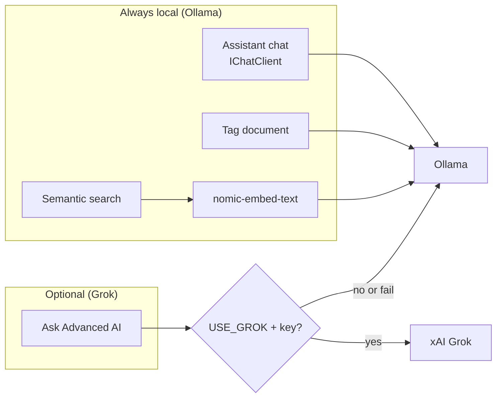

# TIKR Demo — Code Platoon Brief

**Audience:** Engineers, architects, reviewers  
**Duration:** 25–35 minutes (15 min walk + 10–20 min live validation)  
**Stack:** .NET 10 · Blazor Interactive Server · Minimal API · EF Core · Ollama · optional Grok

---

## 1. High-level story

TIKR (**T**own **I**nstitutional **K**nowledge **R**ecorder) is a **local-first** clerk workstation for one-person Colorado municipalities. Data lives on the Synology NAS — SQLite, document files, audit trail — not in a SaaS vault.

| Principle | How TIKR delivers |
|-----------|-------------------|
| Local-first | Docker Compose on NAS; Ollama on-box; optional Grok only when clerk opts in |
| Institutional memory | Requirements (statutory deadlines), Documents (folders + AI tags), Vault (tribal knowledge + voice notes) |
| Hybrid AI | Ollama for everyday chat, tagging, embeddings; Grok gated by `USE_GROK` for “Ask Advanced AI” |
| Clerk UX | Syncfusion grids, scheduler, PDF preview, speech-to-text — tuned for 44px touch targets |

### Architecture (30-second version)

```
Browser → TIKR.Web (:8080) → TIKR.Api (:5000 or :5001 on macOS) → SQLite + /data/documents
                                              ↘ Ollama (local) + optional Grok (HTTPS)
```

**North stars:** [architecture.md](architecture.md) · [incremental-plan.md](incremental-plan.md) · API map: [diagrams/04-api-surface.mmd](diagrams/04-api-surface.mmd)

---

## 2. Code walk (layers)

### Solution layout

| Project | Role | Key entry |
|---------|------|-----------|
| `TIKR.Web` | Blazor Interactive Server UI | `Program.cs`, `Components/Pages/*.razor` |
| `TIKR.Api` | Minimal Web API | `Program.cs`, `AuthEndpoints.cs` |
| `TIKR.Infrastructure` | EF Core, AI, storage, auth | `Services/HybridAiService.cs`, `Data/TikrDbContext.cs` |
| `TIKR.Shared` | DTOs, entities, interfaces | `DTOs/`, `Interfaces/` |

### Request path (example: document upload)

1. **`Documents.razor`** — `SfUploader` posts multipart to `TikrApiClient.UploadDocumentAsync`.
2. **`Program.cs`** — `POST /api/documents` persists metadata + streams bytes via `IFileStorageService`.
3. **`TikrDbContext`** — `Documents` row; optional `FullTextContent` for search/preview.
4. **Audit** — `IAuditService.LogAsync("Create", …)` for compliance trail.

### UI → API wiring

`TikrApiClient` centralizes HTTP. Blazor pages inject it; server-side calls use internal Docker URL (`TIKR_API_URL=http://tikr-api:8080`). Browser-facing download/preview uses `TIKR_PUBLIC_API_URL` when the Web container cannot proxy bytes to the client.

### Feature hotspots (show in IDE)

| Feature | UI | API / service |
|---------|-----|---------------|
| Dashboard priorities | `Home.razor` | `GET /api/ai/dashboard-priorities` |
| Requirements + agent scan | `Requirements.razor` | `POST /api/ai/agent-scan` |
| Document grid + PDF preview | `Documents.razor` | `GET /api/documents/{id}/content` |
| Vault voice notes | `Vault.razor` | `POST /api/knowledge` (category `VoiceNotes`) |
| Local chat | `Assistant.razor` | Web `IChatClient` → Ollama; advanced → `POST /api/ai/ask-advanced` |
| Grok gate display | `Settings.razor` | `GET /api/ai/status`, `GET /api/system/local-status` |

---

## 3. AI deep-dive

### Hybrid model



### `HybridAiService` (`src/TIKR.Infrastructure/Services/HybridAiService.cs`)

| Method | Model | Notes |
|--------|-------|-------|
| `TagDocumentAsync` | Ollama chat | Parses JSON `{ tags, suggestedFolder }`; best-effort embedding refresh |
| `EmbedDocumentAsync` / `EmbedKnowledgeEntryAsync` | Ollama `nomic-embed-text` | Vectors stored as packed floats on entity |
| `SemanticSearch*Async` | Embeddings + cosine similarity | In-memory rank over DB rows with embeddings |
| `GetDashboardPrioritiesAsync` | Rule-based | Due-date urgency bands (Overdue / High / Medium / Low) |
| `AskAdvancedAsync` | **Grok first, Ollama fallback** | Returns `UsedGrok` true or false — key demo signal |
| `GetStatusAsync` | Probe | `OllamaAvailable`, chat model name, `GrokEnabled` |

**Ask Advanced flow (show this method live):**

```csharp
// HybridAiService.AskAdvancedAsync — simplified
if (grokService.IsEnabled)
{
    var grokAnswer = await grokService.CompleteAsync(prompt, cancellationToken);
    if (!string.IsNullOrWhiteSpace(grokAnswer))
        return new AskAdvancedResponse(grokAnswer, UsedGrok: true);
}
var localAnswer = await GetLocalCompletionAsync(prompt, cancellationToken) ?? "…";
return new AskAdvancedResponse(localAnswer, UsedGrok: false);
```

### Grok configuration

| Variable | Where | Effect |
|----------|-------|--------|
| `USE_GROK` | `docker/.env` → **tikr-api** | `GrokService.IsEnabled` |
| `GROK_API_KEY` | same | Required when enabled |
| `GROK_MODEL` | same | Default `grok-3` |
| `OLLAMA_HOST` | same | `http://ollama:11434` (Docker) or `http://host.docker.internal:11434` (Mac host Ollama) |
| `OLLAMA_CHAT_MODEL` | same | Default `llama3.2:3b` |

**Important:** Grok is **not** a runtime UI toggle — it is an **ops/env toggle** on the API container. The UI reflects state via Settings → AI Status and `UsedGrok` on ask-advanced responses.

### Document agent (Phase 10C)

`POST /api/ai/agent-scan` → `IDocumentAgentService` → Syncfusion Document SDK agent tools (when `USE_SYNCFUSION_AGENT_TOOLS=true`). Returns extracted fields for Requirements pre-fill; UI shows extraction badge (Plain-text vs Syncfusion tools).

### Developer-time AI (not runtime demo)

Cursor MCP: `tikr-rag-mcp`, `sf-blazor-mcp`, Microsoft Learn, Ollama. See [ai-tooling.md](ai-tooling.md).

---

## 4. Packages (pinned highlights)

### TIKR.Web

| Package | Version | Use |
|---------|---------|-----|
| `Microsoft.Extensions.AI` | 10.7.0 | Abstractions for chat client |
| `OllamaSharp` | 5.4.25 | Ollama chat in Assistant |
| `Syncfusion.Blazor.*` | 33.2.15 | Grid, Schedule, InteractiveChat, SfPdfViewer, Speech (Vault), etc. |
| `Markdig` | 1.3.2 | Markdown rendering in Assistant |
| `System.IdentityModel.Tokens.Jwt` | 8.14.0 | Optional auth token handling |

**Rule:** Individual Syncfusion packages only — never add meta `Syncfusion.Blazor` alongside granular packages.

### TIKR.Infrastructure

| Package | Version | Use |
|---------|---------|-----|
| `Microsoft.EntityFrameworkCore.Sqlite` | 10.0.9 | Default NAS database |
| `Npgsql.EntityFrameworkCore.PostgreSQL` | 10.0.2 | Optional PostgreSQL |
| `Microsoft.AspNetCore.Identity.EntityFrameworkCore` | 10.0.9 | Optional multi-user auth |
| `Microsoft.Extensions.AI` + `OllamaSharp` | 10.7.0 / 5.4.25 | Hybrid AI + embeddings |
| `Syncfusion.DocumentSDK.AI.AgentTools` | 33.2.15 | Agent scan extraction |
| `Syncfusion.Licensing` | 33.2.15 | Runtime license registration |

### TIKR.Api

| Package | Version | Use |
|---------|---------|-----|
| `Microsoft.AspNetCore.OpenApi` | 10.0.9 | Dev OpenAPI map |

---

## 5. Demo prep (before audience arrives)

### Start stack

**macOS dev (host Ollama + AirPlay on :5000):**

```bash
cp docker/.env.example docker/.env   # add SYNCFUSION_LICENSE_KEY
# Terminal → Run Task → "TIKR: Docker Compose Up (host Ollama override)"
# Or:
TIKR_API_HOST_PORT=5001 TIKR_PUBLIC_API_URL=http://localhost:5001 \
  docker compose -f docker/docker-compose.yml \
  -f docker/docker-compose.host-ollama.yml \
  -f docker/docker-compose.dev-mac.yml \
  --env-file docker/.env up --build -d
```

**Linux / NAS default:**

```bash
docker compose -f docker/docker-compose.yml --env-file docker/.env up --build -d
```

Set API base for scripts below:

```bash
# macOS dev override
export API=http://localhost:5001
# Linux / NAS default
# export API=http://localhost:5000
```

### Verify Ollama models

```bash
ollama list | grep -E 'llama3.2:3b|nomic-embed-text'
# Or in container: docker exec tikr-ollama ollama list
```

### Sample file for agent scan

Keep a small PDF or `.txt` municipal doc on the desktop (e.g. “Special election filing deadline memo”).

---

## 6. Live demo — Grok toggle (audience-visible)

**Narration:** “Everyday AI stays on the NAS. Grok is opt-in via environment — no hidden cloud calls.”

### Act 1 — Grok OFF (default)

1. Confirm `docker/.env`: `USE_GROK=false`
2. Restart API: `docker compose … restart tikr-api` (or full stack task)
3. **Settings** (`g s`) → AI Status shows **Grok: Disabled**
4. Terminal (project on screen):

```bash
curl -s "$API/api/ai/status" | jq
# Expect: "grokEnabled": false, "ollamaAvailable": true

curl -s -X POST "$API/api/ai/ask-advanced" \
  -H 'Content-Type: application/json' \
  -d '{"prompt":"In one sentence, what is TABOR?","context":null}' | jq
# Expect: "usedGrok": false
```

5. **Assistant** (`g a`) → ask a question in chat (Ollama streams) → click **Ask Advanced AI (Grok)** → note says Ollama fallback / not Grok

### Act 2 — Grok ON

1. Edit `docker/.env`: `USE_GROK=true` and set real `GROK_API_KEY`
2. `docker compose … restart tikr-api`
3. **Settings** → **Grok: Enabled**
4. Terminal:

```bash
curl -s "$API/api/ai/status" | jq
# Expect: "grokEnabled": true

curl -s -X POST "$API/api/ai/ask-advanced" \
  -H 'Content-Type: application/json' \
  -d '{"prompt":"In one sentence, what is TABOR?","context":null}' | jq
# Expect: "usedGrok": true
```

5. **Assistant** → **Ask Advanced AI** → note says “Grok response shown below”

### Act 3 — Grok key invalid (optional 60s)

Set bad key, restart API → `usedGrok: false` with Ollama fallback (proves resilience, not failure).

---

## 7. Live demo — full API matrix (curl)

Run in a second terminal tab; `jq` optional but recommended. Auth omitted (default single-clerk open API).

```bash
set -e
API="${API:-http://localhost:5000}"

echo "=== System ==="
curl -sf "$API/health" | jq
curl -sf "$API/api/system/local-status" | jq

echo "=== AI status ==="
curl -sf "$API/api/ai/status" | jq
curl -sf "$API/api/ai/dashboard-priorities" | jq

echo "=== Requirements CRUD ==="
REQ=$(curl -sf -X POST "$API/api/requirements" \
  -H 'Content-Type: application/json' \
  -d '{"title":"Demo filing","description":"Live API test","dueDate":"2026-12-31","recurrence":"Annual","category":"Elections"}')
echo "$REQ" | jq
RID=$(echo "$REQ" | jq -r '.id')
curl -sf "$API/api/requirements" | jq 'length'
curl -sf "$API/api/requirements/$RID" | jq

echo "=== Knowledge CRUD ==="
KNOW=$(curl -sf -X POST "$API/api/knowledge" \
  -H 'Content-Type: application/json' \
  -d '{"title":"Demo contact","content":"County clerk: 555-0100","category":"Contacts","sortOrder":0}')
echo "$KNOW" | jq
KID=$(echo "$KNOW" | jq -r '.id')
curl -sf "$API/api/knowledge" | jq 'length'

echo "=== Document upload ==="
echo "Sample municipal memo for demo." > /tmp/tikr-demo.txt
DOC=$(curl -sf -X POST "$API/api/documents" \
  -F "file=@/tmp/tikr-demo.txt")
echo "$DOC" | jq
DID=$(echo "$DOC" | jq -r '.id')
curl -sf "$API/api/documents/$DID/content" -o /tmp/tikr-download.txt
cmp -s /tmp/tikr-demo.txt /tmp/tikr-download.txt && echo "Download OK"

echo "=== AI: tag, embed, search ==="
curl -sf -X POST "$API/api/ai/tag-document" \
  -H 'Content-Type: application/json' \
  -d "{\"documentId\":\"$DID\"}" | jq
curl -sf -X POST "$API/api/ai/embed-document/$DID" | jq
curl -sf -X POST "$API/api/ai/semantic-search" \
  -H 'Content-Type: application/json' \
  -d '{"query":"municipal memo","topK":3}' | jq
curl -sf -X POST "$API/api/ai/embed-knowledge/$KID" | jq
curl -sf -X POST "$API/api/ai/semantic-search-knowledge" \
  -H 'Content-Type: application/json' \
  -d '{"query":"county clerk phone","topK":3}' | jq

echo "=== Agent scan ==="
curl -sf -X POST "$API/api/ai/agent-scan" \
  -F "file=@/tmp/tikr-demo.txt" | jq

echo "=== Audit ==="
curl -sf "$API/api/audit?limit=5" | jq

echo "=== Cleanup (optional) ==="
curl -sf -X DELETE "$API/api/documents/$DID"
curl -sf -X DELETE "$API/api/knowledge/$KID"
curl -sf -X DELETE "$API/api/requirements/$RID"

echo "ALL API CHECKS PASSED"
```

**Optional auth block** (only if `TIKR_AUTH_ENABLED=true`):

```bash
TOKEN=$(curl -sf -X POST "$API/api/auth/login" \
  -H 'Content-Type: application/json' \
  -d '{"email":"clerk@yourtown.gov","password":"..."}' | jq -r '.token')
AUTH=(-H "Authorization: Bearer $TOKEN")
curl -sf "${AUTH[@]}" "$API/api/auth/me" | jq
```

---

## 8. Talking points for Q&A

- **Why Blazor Interactive Server?** Single-clerk LAN deployment; rich Syncfusion components without shipping a WASM payload to clerks on rural connections.
- **Why SQLite default?** Zero ops on NAS; PostgreSQL switch is config-only.
- **Why two AI tiers?** Cost + privacy for daily work; Grok only when statute interpretation needs heavier reasoning.
- **Test confidence:** `dotnet test TIKR.sln --configuration Release` (294+ tests); `--filter "Category=FullyTested"` for ship-bar subset.

---

## 9. Related docs

- [docker/README.md](../docker/README.md) — Compose, IDE tasks, macOS port 5001
- [ai-tooling.md](ai-tooling.md) — MCP, secrets, troubleshooting
- [architecture.md](architecture.md) — diagrams and NAS deployment
