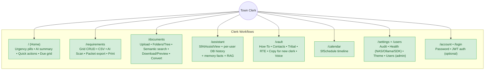
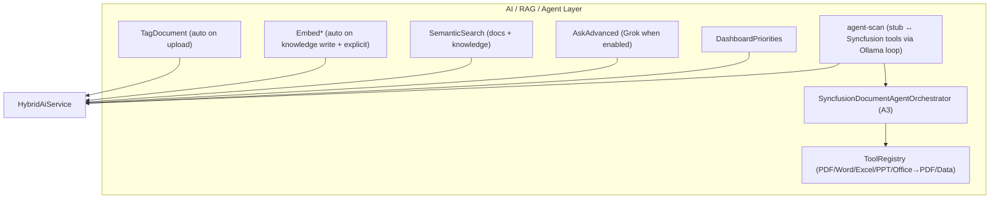

<!-- markdownlint-disable MD033 MD047 -->
# TIKR Function Tree (Visual Overview — Maintained Layer)

**Auto-generated raw data:** [function-inventory.generated.md](./function-inventory.generated.md)
**Human overlay + status:** [action-items.md](./action-items.md)
**Update when structure changes.** Seed from script output + existing `docs/diagrams/03-clerk-feature-map.mmd` and `04-api-surface.mmd`.

> This is the **maintained visual** complement to the hybrid inventory. Use Mermaid for clerk + agent comprehension.

## Clerk Workflows (Primary Surfaces)



## Cross-cutting & System

```mermaid
flowchart LR
    subgraph Cross["Cross-cutting UX"]
        Offline[Offline banner]
        Footer[NAS status footer + SDK status]
        Help[PageHelp on main pages]
        Delete[Confirm delete + undo toast]
        Keys[? shortcuts + g-nav]
        Theme[Theme (light/dark/high-contrast)]
    end

    subgraph System["System / AI / Data"]
        Health["/health + /api/system/*"]
        AI["HybridAiService (Ollama + gated Grok)"]
        RAG["Semantic + embeddings (nomic)"]
        Agent["DocumentAgentService + Syncfusion Orchestrator + ToolRegistry"]
        Gen["Document generation (Syncfusion) + council packet"]
        Auth["Optional ASP.NET Identity + JWT + policies"]
        Audit["Audit log"]
    end

    Cross --> ClerkWorkflows
    System --> ClerkWorkflows
```

## AI / Agent Layer Detail



## Key Workflows (High-Level)

- **AI Scan flow**: Upload (Requirements) → agent ProcessUpload → pre-fill dialog (see 05b-requirements-agent-scan.mmd + action-items).
- **Semantic + RAG**: Write triggers embed → search prepends context in Assistant + Documents toggle (05c, 05d).
- **Generation + persist**: Packet / agenda / minutes / memo / compliance → NAS store + audit.
- **Health everywhere**: Local status footer + SDK badge on all pages.

**Status legend (aligns with diagrams):**
- Green/done: shipped on main
- Gray/defer: vNext (Phase 6 smart components, Phase 9 previews, etc.)

See `docs/diagrams/README.md` for sequence diagrams (05a–05e) and architecture.md for C4 views.

---

*Keep this file in sync with structural changes detected by the inventory script.*
