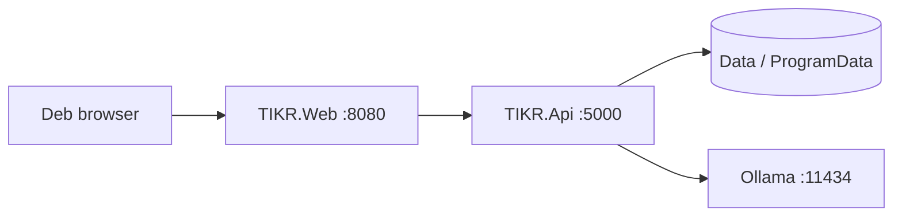

# Windows thumb-drive deploy (Dell laptop test)

Use this when you want **TIKR on a Windows PC without Docker** — USB stick → Dell.

**Easy path for Deb:** copy `TIKR-Deploy` → run `Install-TIKR.cmd` as Admin → edit `syncfusion-license.txt` → `Start-TIKR.bat`.  
Full one-pager: [clerk-windows-install.md](clerk-windows-install.md) (Setup.exe when IT builds it).

**NAS production** remains Docker on Synology ([deb-nas-install.md](deb-nas-install.md)).

---

## Mental model (no separate “client vs server” installs)

On the Dell, **both** processes run on the **same PC**:

| Piece | Role | Port |
|-------|------|------|
| `TIKR.Web.exe` | UI Deb sees in the browser | `http://localhost:8080` |
| `TIKR.Api.exe` | Database, documents, AI tagging/search | `http://localhost:5000` |
| `Data\` | Database + uploaded files | next to the apps (USB mode) |

The browser is the only client. You do **not** install Web on one machine and Api on another for day-1.

When IT ships **`Setup-TIKR.exe`** later, paths split like a normal Windows app:

| What | Path |
|------|------|
| Programs (Api + Web + launchers) | `C:\Program Files\TIKR\` |
| Clerk data (db, documents) | `C:\ProgramData\TIKR\` |

Same two programs — only install locations change.



---

## What you get in `publish/TIKR-Deploy`

| Piece | Role |
|-------|------|
| `TIKR.Api\` | Self-contained Windows API |
| `TIKR.Web\` | Self-contained Windows Blazor UI |
| `Data\` | Empty folder for SQLite + uploads (created/filled on first run) |
| `Install-TIKR.cmd` | **Preferred** one-time setup (firewall + license file + Ollama helper) |
| `Start-TIKR.bat` | Daily start |
| `Stop-TIKR.ps1` | Stop both processes |
| `Ensure-Ollama.ps1` | Install/start Ollama + pull models (best-effort) |
| `syncfusion-license.txt` | One-line Syncfusion key (edit in Notepad) |

There is **no single `TIKR.exe`** — two processes by design.

---

## Build the USB package (Mac)

```bash
./scripts/package-thumb-drive.sh
# Output: publish/TIKR-Deploy/ and publish/TIKR-Deploy-win-x64.zip
```

Fast rebuild:

```bash
SKIP_TESTS=1 ./scripts/package-thumb-drive.sh
```

Copy **`TIKR-Deploy`** (or the zip) to the thumb drive — not the loose `publish/TIKR.Api` / `publish/TIKR.Web` folders alone.

---

## On the Dell (first time)

1. Copy `TIKR-Deploy` to Desktop (or `C:\TIKR`).
2. Right-click **`Install-TIKR.cmd` → Run as administrator**.
3. Edit **`syncfusion-license.txt`** — one line = Syncfusion Community key.
4. Double-click **`Start-TIKR.bat`**.

See `README-QuickStart.txt` inside the deploy folder.

---

## Troubleshooting

| Symptom | Check |
|---------|--------|
| Scripts “do nothing” / flash | Use `Install-TIKR.cmd` and `Start-TIKR.bat`, not raw `.ps1` double-click without Bypass |
| Missing exe | Package incomplete — rebuild with `package-thumb-drive.sh` and copy whole folder |
| Trial banner | `syncfusion-license.txt` wrong/empty |
| Assistant offline | Ollama installed; re-run Install or open https://ollama.com |
| Web loads, no data | API window still open; `http://localhost:5000/health` |

---

## Related

- [clerk-windows-install.md](clerk-windows-install.md) — Setup.exe day-1 story  
- [ship-to-production.md](ship-to-production.md) — NAS/GHCR  
- [scripts/publish-tikr.sh](../scripts/publish-tikr.sh) — publish only  
